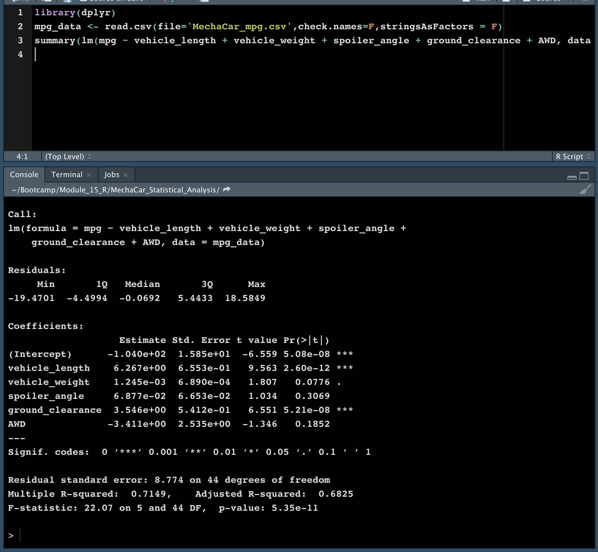
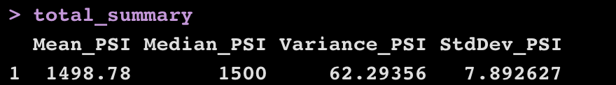
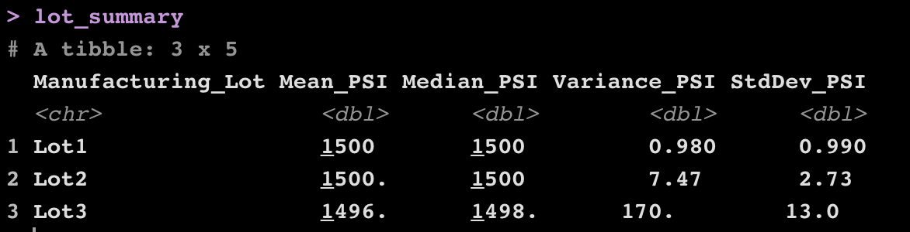
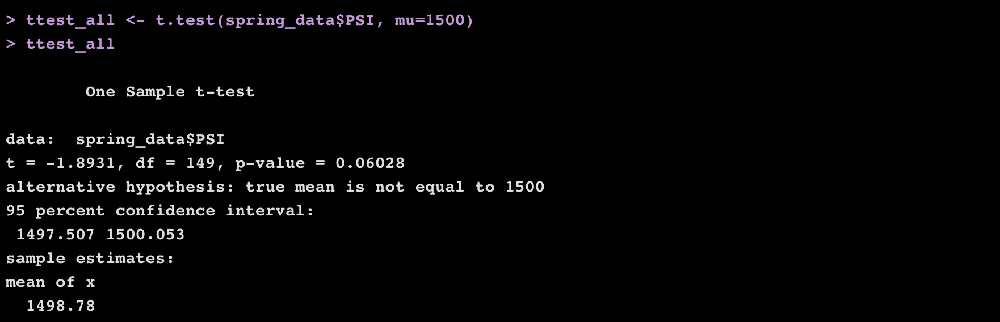
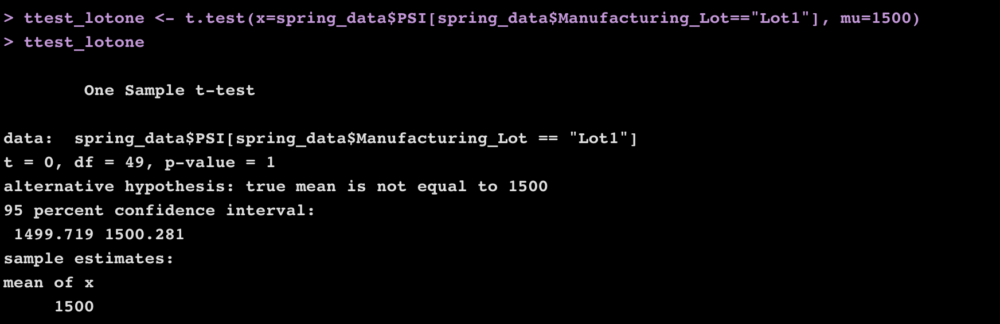
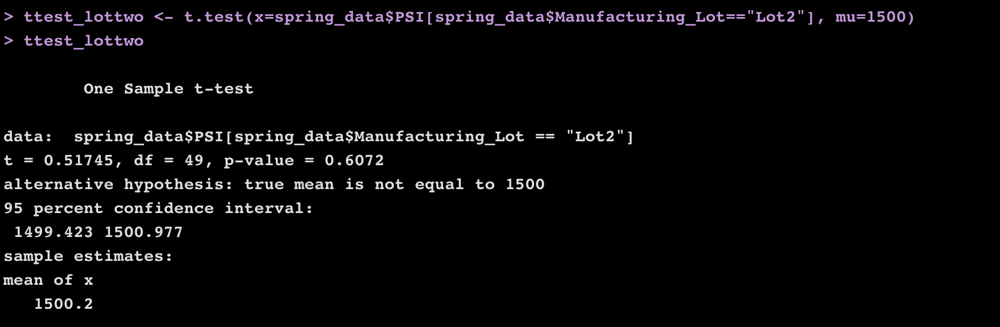
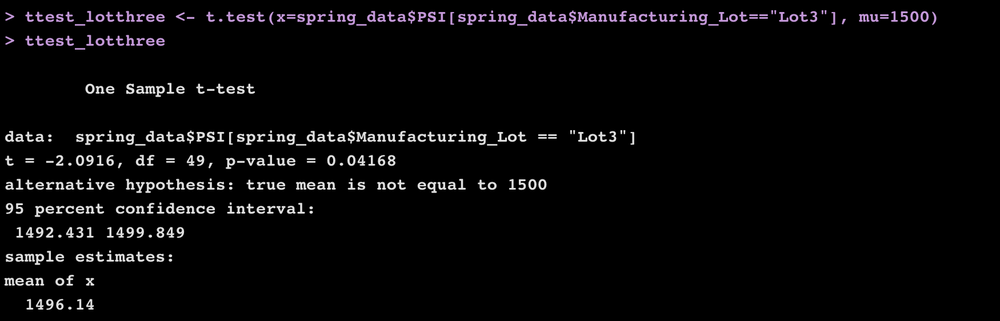

# MechaCar_Statistical_Analysis
Auto parts analysis for UT Austin Data Analysis Program

## Tools
R, RStudio

## Linear Regression to Predict MPG

We began by reading in the MPG csv file, then used the summary function `summary(lm(mpg ~ vehicle_length + vehicle_weight + spoiler_angle + ground_clearance + AWD, data = mpg_data))` to create the following summary dataframe:

 

 
This shows that vehicle length and ground clearance are the two factors which provide non-random variance to the mpg values in the dataset.
Sincve the r-squared value is 0.68, which means that the slope of the linear model can be considered to be zero.
This linear model does predict mpg of MechaCar prototypes effectively.

## Summary Statistics on Suspension Coils
We then read in the suspension coil csv file and created a summary using the function `total_summary <- spring_data %>% summarize(Mean_PSI=mean(PSI),Median_PSI=median(PSI),Variance_PSI=var(PSI),StdDev_PSI=sd(PSI)) #create summary table with multiple columns`. This produced the following summary dataframe:

 

 
We repeated the steps above, this time grouping the springs by their manufacturing lot:

 

 
The design specifications for the MechaCar suspension coils dictate that the variance of the suspension coils must not exceed 100 pounds per square inch. The current manufacturing data indicates that this set of coils overall meets design criteria since the overall variance is 62psi. However, the variance within lot 3 is 170psi, which does not meet design criteria.

## T-Tests on Suspension Coils
We then wrote a t-test to determine if the PSI across all manufacturing lots is statistically different from the population mean of 1,500 pounds per square inch, using the following t-test function: `ttest_all <- t.test(spring_data$PSI, mu=1500)`. Since the p-value is over .05 we failed to reject the null hypothesis, meaning the overall psi is not statistically different.

 

 
We repeated the steps for each lot as a subset. Lot 3 had p-values under 0.05, which means its psi was statistically different.

 

 

 

 

 

 

## Study Design: MechaCar vs Competition
In order to compare how MechaCar performs against the competition we would need to perform a two-sample t-test comparing data such as cost, mpg, horsepower, torque, and safety rating. The null hypothesis would be that the differences between the two models of car can be attributed to random chance. We would need data from both manufacturers on all of these criteria - cost, mpg, horsepower, torque, and safety rating from a large population of each car in order to run the test. 

